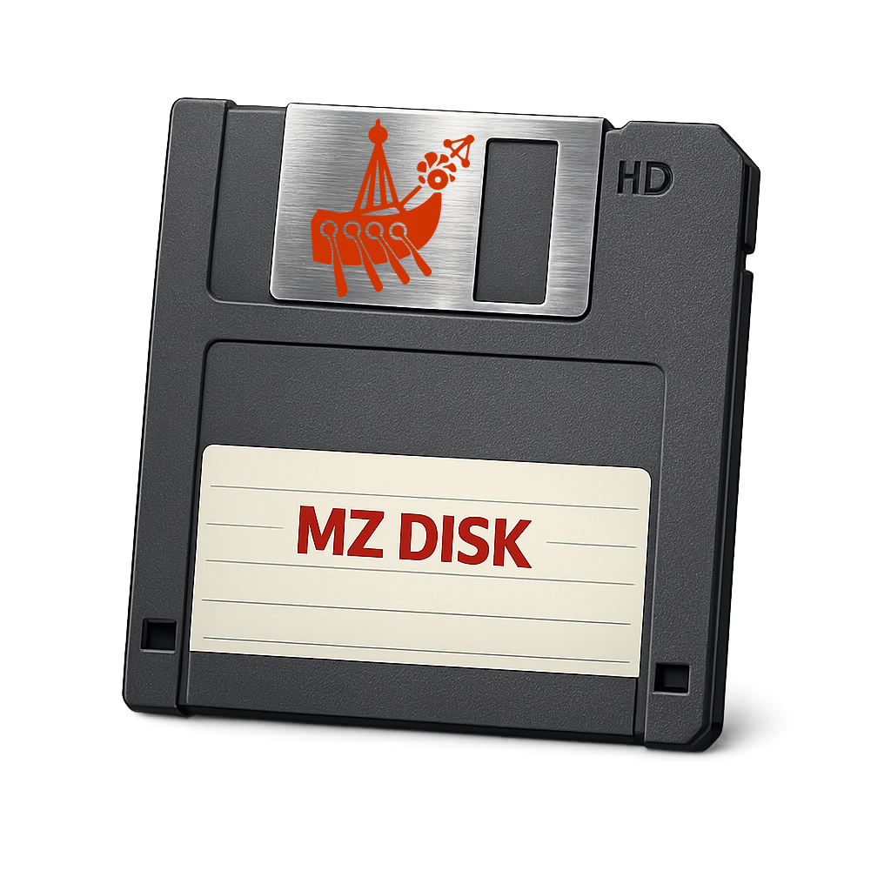
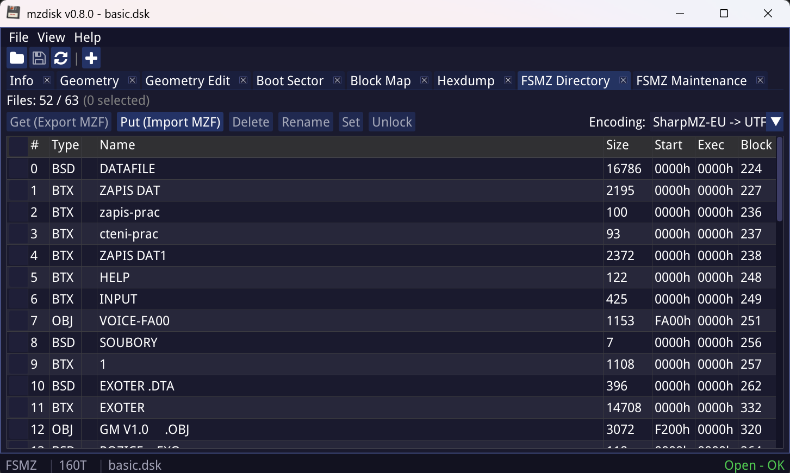
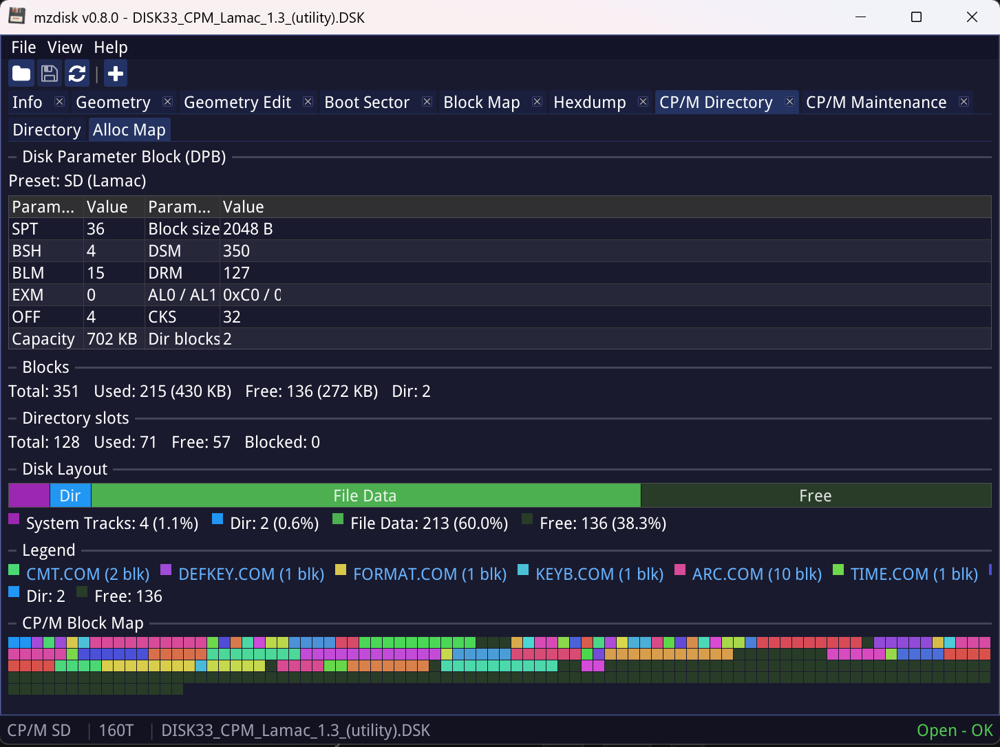
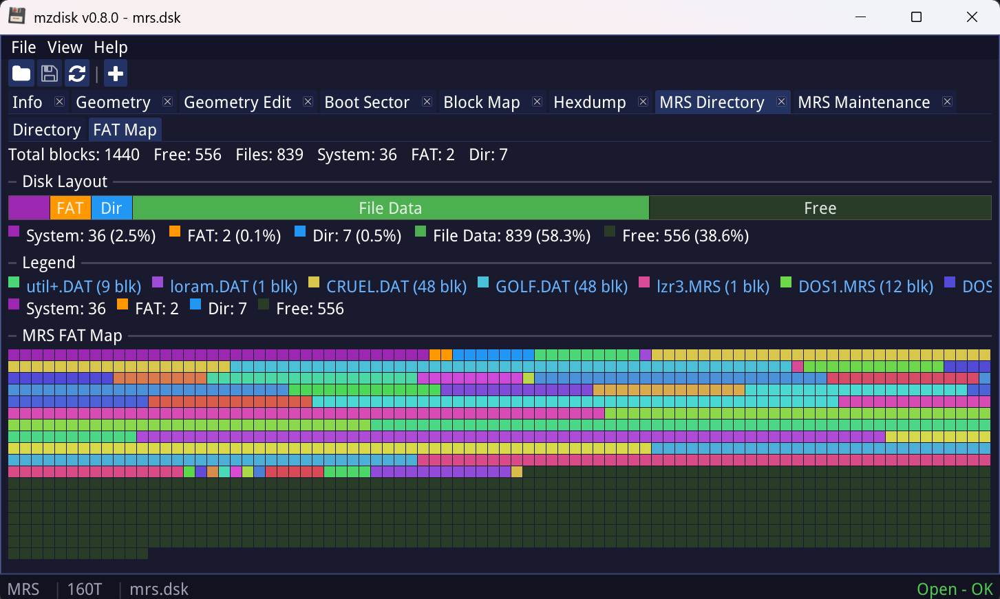
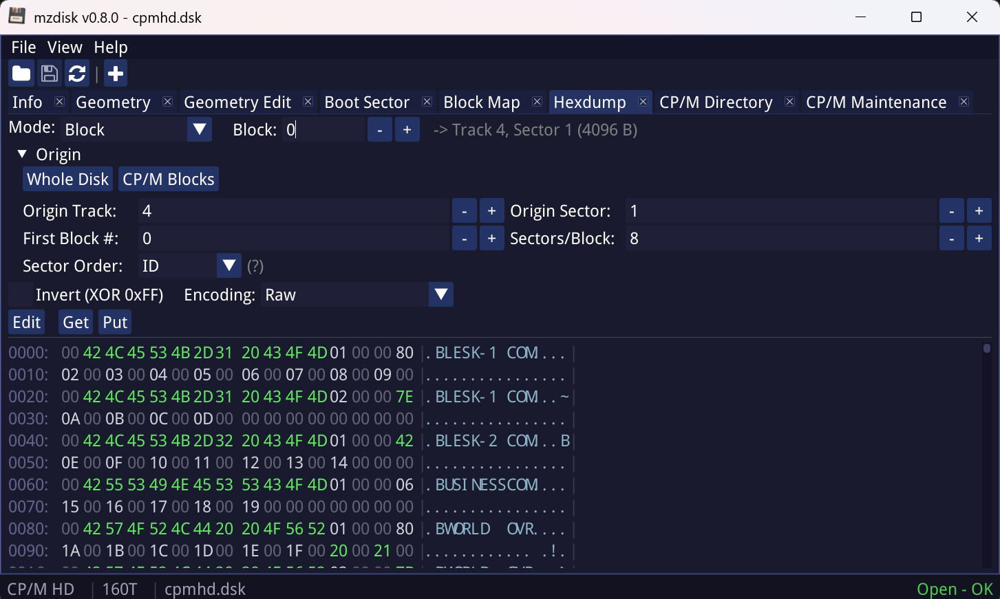
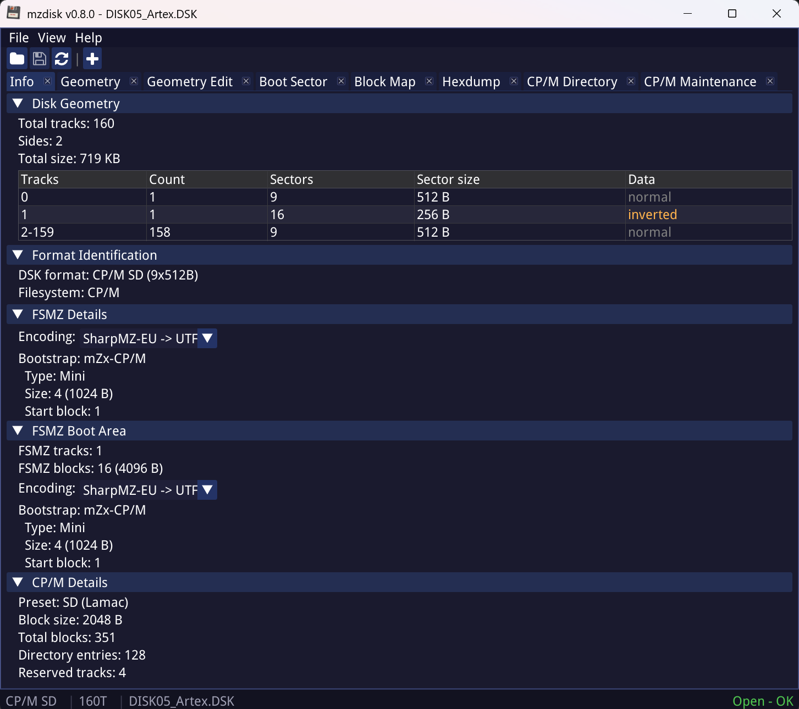
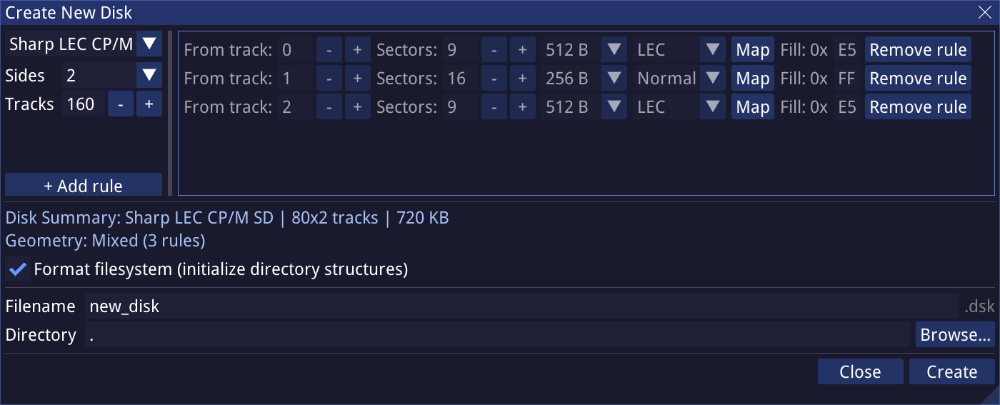
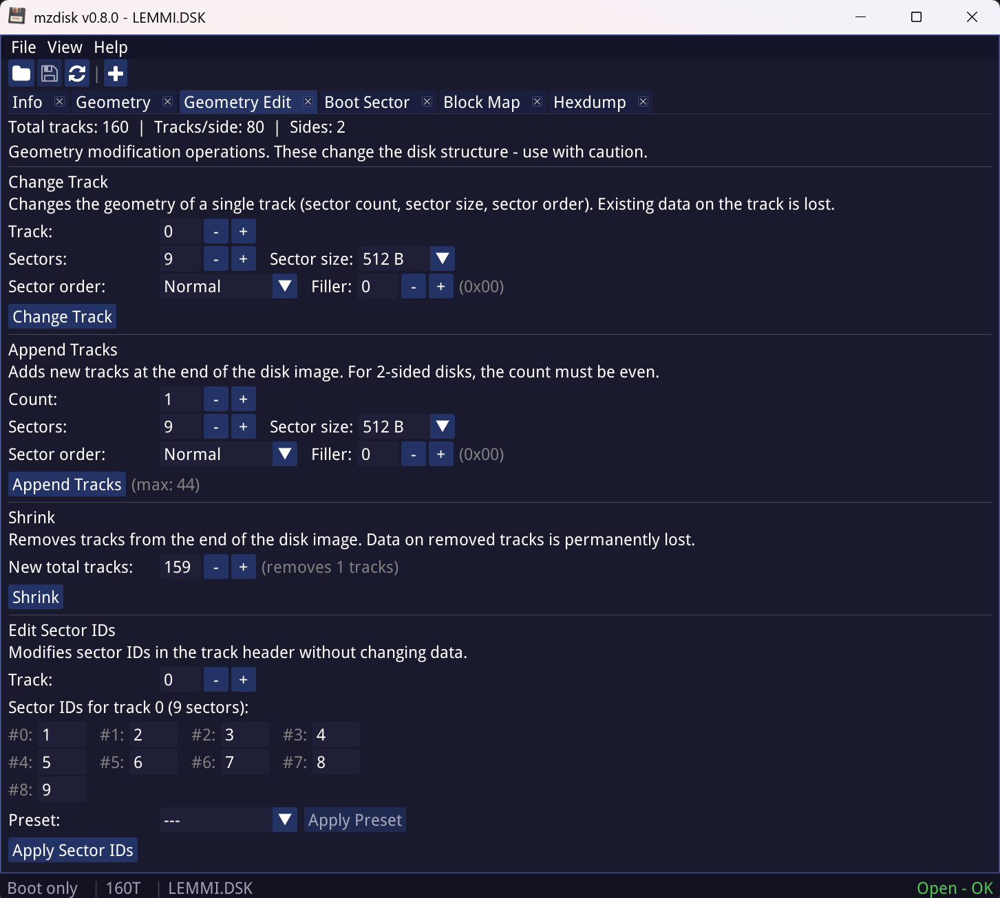
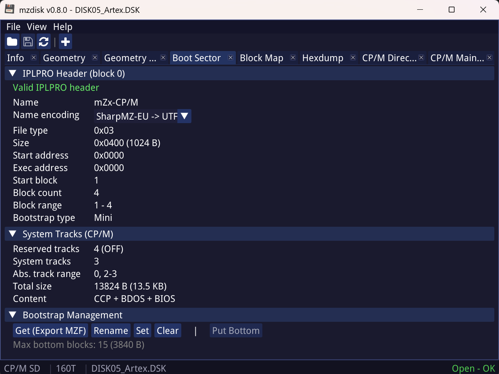
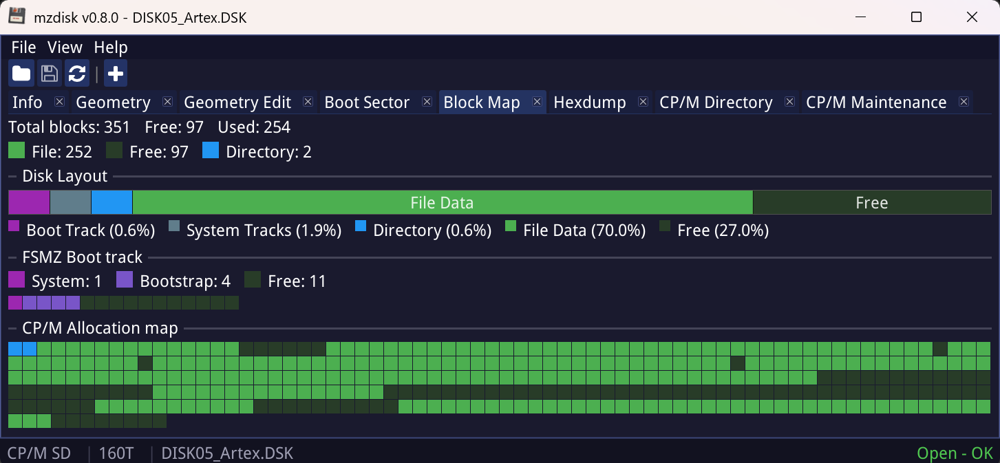

<div align="right">
<b>🇬🇧 English</b> | <a href="README_cz.md">🇨🇿 Čeština</a>
</div>

<p align="center">
  
</p>

<h1 align="center">mzdisk</h1>

<p align="center">
  <b>Tools and GUI for managing disk images of Sharp MZ computers</b><br>
  <sub>MZ-700 &middot; MZ-800 &middot; MZ-1500</sub>
</p>

<p align="center">
  <a href="docs/en/Changelog.md"></a>
  <a href="docs/en/Changelog.md"></a>
  
  
  
  
</p>

---

## What is mzdisk

**mzdisk** is a toolkit for working with disk images (DSK) of Sharp MZ computers.
The project provides:

- a **GUI application** (`mzdisk`) for convenient interactive disk management,
- a **set of seven CLI tools** (`mzdsk-*`) for scripting and batch operations,
- **shared C libraries** for integration into your own projects.

Supported file systems:

- **FSMZ** - the original MZ-BASIC format with inverted data and an IPLPRO bootstrap,
- **CP/M 2.x** - presets SD by Jiří Lamač - LEC (1988, 89), HD by LuckySoft (1993), SD2S, HD2S, and custom DPB,
- **MRS** - FAT-based file system by Vlastimil Veselý - TRIPS (1993).

> **Historical note**
>
> mzdisk is the continuation and full successor of my older project **FSTOOLS**,
> which has been dormant for more than ten years. If you have been using FSTOOLS,
> mzdisk replaces it in every aspect - it adds support for more file systems,
> a graphical interface, and a modern code base.

---

## GUI at a glance

<table>
<tr>
<td width="50%"></td>
<td width="50%"></td>
</tr>
<tr>
<td align="center"><sub>FSMZ directory with character set conversion</sub></td>
<td align="center"><sub>CP/M - directory, DPB and block map</sub></td>
</tr>
<tr>
<td width="50%"></td>
<td width="50%"></td>
</tr>
<tr>
<td align="center"><sub>MRS directory and FAT map</sub></td>
<td align="center"><sub>Hex editor with auto-inversion and CG-ROM glyphs</sub></td>
</tr>
</table>

---

## Key features

### Supported formats and disks
- DSK container: Extended CPC DSK format
- File systems: FSMZ, CP/M 2.x (SD/HD/SD2S/HD2S + custom DPB), MRS
- Automatic FS detection from geometry and content
- Automatic detection and handling of data inversion (FSMZ, MRS)

### File operations
- Browsing the contents of all supported file systems
- Import and export of files, MZF containers
- Delete, rename, lock (attributes on CP/M)
- Drag &amp; drop of files **between windows** (including cross-FS conversion via MZF)
- Format, defragmentation and repair tools

### Low-level operations
- DSK container editing (tracks, sector IDs, gap, filler, FDC status)
- Disk geometry editing, bootstrap (IPLPRO) editing
- Raw access to sectors and blocks
- Hex editor with optional inversion and six character display modes
  (Raw, Sharp MZ EU/JP ASCII, UTF-8 EU/JP, CG-ROM glyphs)

### Sharp MZ character sets
- Conversion between Sharp MZ ASCII and UTF-8 (EU and JP variants)
- Display of pixel-art glyphs from CG-ROM (font `mzglyphs.ttf`,
  four character sets EU1/EU2/JP1/JP2)
- Editing text in Sharp MZ encoding directly in the hex editor

### Multi-window features
- Multi-window: up to **16 disks open simultaneously** in a single instance
- Each window has its own menu bar, toolbar, and status bar
- A separate OS window per session (multi-viewport)
- Independent Open/Save/Close operations at window level

---

## mzdisk GUI application

The Info tab of an opened disk and the dialog for creating a new disk:

<p align="center">
  
  &nbsp;
  
</p>

Geometry and bootstrap sector editing:

<p align="center">
  
  &nbsp;
  
</p>

Disk occupancy visualization (CP/M block map):

<p align="center">
  
</p>

More screenshots are available in the [screenshot/](screenshot/) directory.

### GUI technologies
- **SDL3** for windows and input
- **Dear ImGui** with the multi-viewport and docking branch
- **OpenGL** backend
- Fully localizable interface (locales)

---

## CLI tools

Seven specialized binaries, each focused on a single layer
or a single file system. All of them are part of the portable distribution.

| Tool | Description | Documentation |
|---|---|---|
| `mzdsk-info` | Read-only DSK inspection - geometry, map, boot sector, hexdump | [docs/en/tools-mzdsk-info.md](docs/en/tools-mzdsk-info.md) |
| `mzdsk-create` | Creation of new DSK images (presets basic / cpm-sd / cpm-hd / mrs / lemmings + custom geometry) | [docs/en/tools-mzdsk-create.md](docs/en/tools-mzdsk-create.md) |
| `mzdsk-dsk` | DSK container diagnostics and editing (info, tracks, check, repair, edit-header, edit-track) | [docs/en/tools-mzdsk-dsk.md](docs/en/tools-mzdsk-dsk.md) |
| `mzdsk-fsmz` | Complete FSMZ management (dir, get/put, bootstrap, format, repair, defrag) | [docs/en/tools-mzdsk-fsmz.md](docs/en/tools-mzdsk-fsmz.md) |
| `mzdsk-cpm` | Complete CP/M management (dir, get/put/era/ren, attr, map, dpb, format) | [docs/en/tools-mzdsk-cpm.md](docs/en/tools-mzdsk-cpm.md) |
| `mzdsk-mrs` | MRS operations (info, dir, fat, init, defrag) | [docs/en/tools-mzdsk-mrs.md](docs/en/tools-mzdsk-mrs.md) |
| `mzdsk-raw` | Raw access to sectors and blocks, geometry modification | [docs/en/tools-mzdsk-raw.md](docs/en/tools-mzdsk-raw.md) |

Options supported across all tools:

- `--format json|csv` - machine-readable output (for scripting)
- `--charset eu|jp|utf8-eu|utf8-jp` - file name conversion
- `--dump-charset raw|eu|jp|utf8-eu|utf8-jp` - character mode in the hexdump

---

## Quick start

```bash
# Create a new CP/M SD disk
mzdsk-create --preset cpm-sd my.dsk

# Inspect the contents with automatic FS detection
mzdsk-info my.dsk --map

# Import an MZF file into an FSMZ disk
mzdsk-fsmz basic.dsk put program.mzf

# Launch the GUI (with an optional input file)
mzdisk basic.dsk
```

---

## Installation and build

### Binaries (Windows)

Pre-built portable ZIP archives for Windows are available
in [GitHub Releases](https://github.com/michalhucik/mzdisk/releases).

The portable distribution contains two separate folders:

- `mzdisk/` - GUI application + all required DLLs and UI resources
- `mzdisk-cli/` - CLI tools + documentation (`.md`, optionally `.html`)

### Build from source

Prerequisites:

- CMake 3.16+
- C compiler with C11 support (GCC 10+ or Clang 12+)
- For the GUI additionally: SDL3 and OpenGL
- Linux or Windows (MSYS2 / MinGW-w64)

```bash
# Shared libraries
make libs

# CLI tools
make cli

# GUI application
make gui

# Portable distribution (GUI + CLI, Markdown docs only)
make portable

# Portable distribution including HTML documentation
# (requires python3 and the `markdown` Python module)
make portable-full

# HTML documentation only (optional, generated from docs/*/*.md)
make docs-html

# Tests (488 tests - libraries, GUI logic, CLI integration)
make test
```

> **Note:** HTML documentation generation is an optional step. `make portable`
> and `make portable-cli` work without Python, and HTML files are included
> in the bundle only if the `docs-html/` directory already exists (typically
> created by `make docs-html` or `make portable-full`).

Build outputs:

- `build-libs/` - static libraries `.a`
- `build-cli/` - seven CLI binaries
- `build-gui/mzdisk` (Linux) or `build-gui/mzdisk.exe` (Windows)
- `build-tests/` - test binaries
- `portable/` - distribution folders

---

## Documentation

- [CLI tools documentation (en)](docs/en/) - `tools-mzdsk-*.md`
- [CLI tools documentation (cz)](docs/cz/)
- [Changelog (en)](docs/en/Changelog.md) &middot; [Changelog (cz)](docs/cz/Changelog.md)

---

## License and disclaimer

The project is distributed under the **GPLv3** license without any warranty.

> ⚠️ **Always work on a copy of the DSK image, never on the original.**
> The author of the project provides no warranty and is not liable for any
> loss or damage of data caused by using the tools of the mzdisk project.

---

## Author

**Michal Hučík** - [github.com/michalhucik](https://github.com/michalhucik)

Thanks go to all the authors of the historical file system specifications
of the Sharp MZ computers and to the retro community that keeps these
machines alive.
